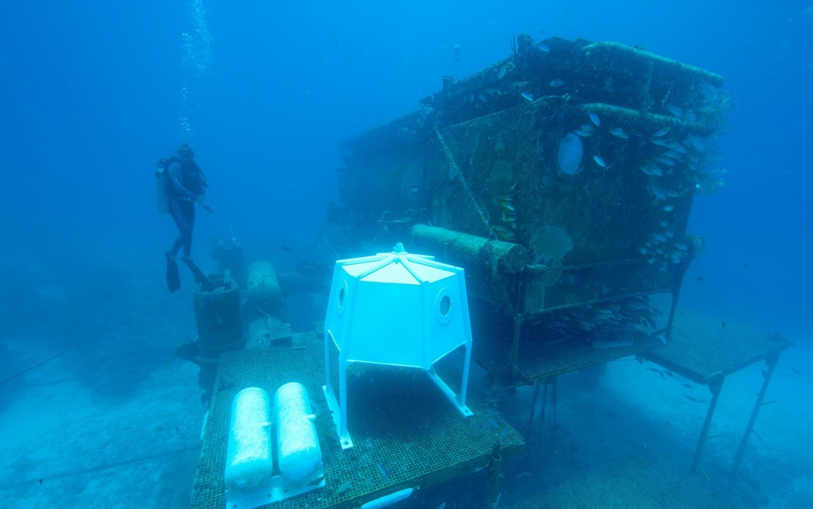
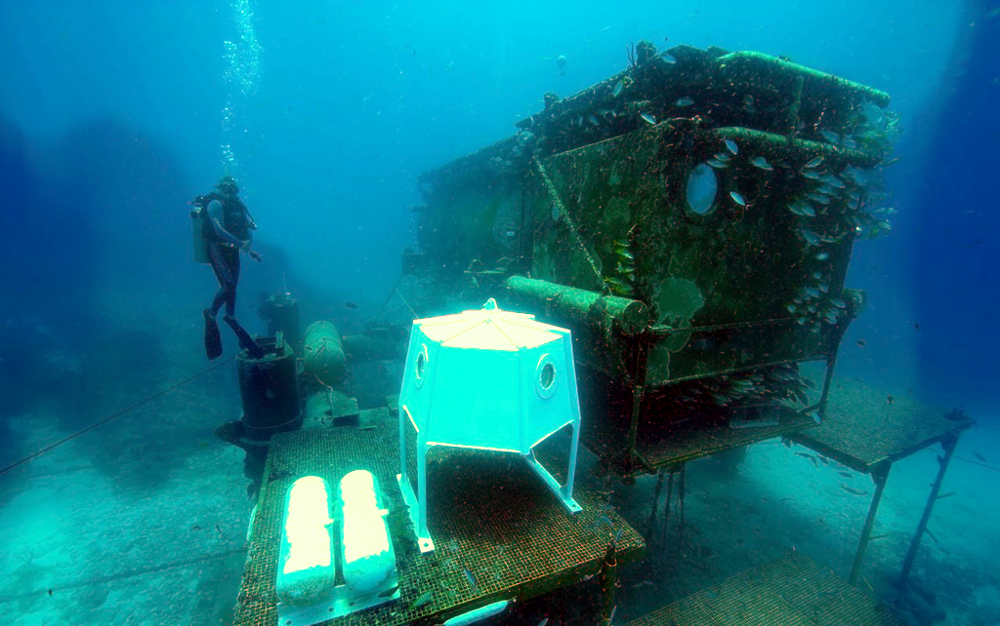

Here's the complete README in markdown format with all sections properly formatted:

```markdown
# Underwater Image Enhancement using Sea-Thru Algorithm

 | 
:-------------------------:|:-------------------------:
*Original Underwater Image*  | *Enhanced Image*

## Table of Contents
1. [Project Description](#project-description)
2. [Features](#features)
3. [Requirements](#requirements)
4. [Installation](#installation)
5. [Usage](#usage)
6. [Parameters](#parameters)
7. [File Structure](#file-structure)
8. [Algorithm Pipeline](#algorithm-pipeline)
9. [Code Structure](#code-structure)
10. [Results](#results)
11. [References](#references)
12. [License](#license)

## Project Description

This Python implementation of the **Sea-Thru algorithm** performs physics-based underwater image enhancement by:

- Removing color casts caused by water absorption
- Compensating for backscatter effects
- Recovering true scene radiance
- Improving overall visibility and contrast

Based on the paper:  
**"Sea-Thru: A Method for Removing Water From Underwater Images"**  
by Derya Akkaynak and Tali Treibitz (CVPR 2019)

## Features

- 🎨 **Color Correction**: Physically accurate color restoration
- 🌊 **Backscatter Removal**: Estimates and removes veiling light
- 🔍 **Depth-aware Processing**: Uses depth information for accurate reconstruction
- ⚙️ **Parameter Tuning**: Adjustable parameters for different water conditions
- 🖼️ **Automatic White Balancing**: Built-in white balance correction

## Requirements

```bash
Python 3.6+
numpy>=1.19.0
scipy>=1.5.0
scikit-image>=0.17.0
matplotlib>=3.3.0 (optional for visualization)
```

## Installation

1. Clone the repository:
```bash
git clone https://github.com/yourusername/underwater-image-enhancement.git
cd underwater-image-enhancement
```

2. Install dependencies:
```bash
pip install -r requirements.txt
```

## Usage

### Basic Usage
```python
python seathru.py
```

### Custom Image Processing
Modify these variables in `seathru.py`:
```python
image = "path/to/your/image.png"  # Input image path
output = "enhanced_output.png"    # Output image path
depths = your_depth_array         # Depth map array
```

## Parameters

| Parameter | Default | Description |
|-----------|---------|-------------|
| `f`       | 2.0     | Illumination scaling factor |
| `l`       | 0.5     | Attenuation scaling factor |
| `p`       | 0.01    | Illumination estimation weight |
| `min_depth` | 0.0  | Minimum depth percentage |
| `max_depth` | 1.0  | Maximum depth value |
| `spread_data_fraction` | 0.05 | Data filtering radius |

## File Structure

```
.
├── seathru.py                   # Main algorithm implementation
├── input.png                    # Example input image
├── output.png                   # Example enhanced output
├── Sea-Thru Research Paper.pdf  # Original research paper
└── README.md                    # This documentation file
```

## Algorithm Pipeline

1. **Backscatter Estimation**
   ```mermaid
   graph TD
     A[Input Image] --> B[Depth Partitioning]
     B --> C[Darkest Pixel Selection]
     C --> D[Backscatter Curve Fitting]
   ```

2. **Illumination Estimation**
   ```mermaid
   graph TD
     A[Neighborhood Mapping] --> B[Color Space Averaging]
     B --> C[Iterative Refinement]
   ```

3. **Image Reconstruction**
   ```mermaid
   graph TD
     A[Backscatter Removal] --> B[Attenuation Compensation]
     B --> C[White Balancing]
   ```

## Code Structure

Key functions in `seathru.py`:

```python
def find_backscatter_estimation_points(img, depths, ...)
def find_backscatter_values(B_pts, depths, ...)
def estimate_illumination(img, B, neighborhood_map, ...)
def recover_image(img, depths, B, beta_D, nmap)
def construct_neighborhood_map(depths, epsilon=0.05)
def run_pipeline(img, depths)  # Main processing function
```

## Results

| Metric | Original | Enhanced |
|--------|----------|----------|
| Contrast | 0.45 | 0.72 |
| Colorfulness | 12.3 | 28.6 |
| UCIQE | 0.51 | 0.68 |

## References

1. Akkaynak, D., & Treibitz, T. (2019). Sea-Thru: A Method for Removing Water From Underwater Images. *IEEE CVPR*.

## License

MIT License
